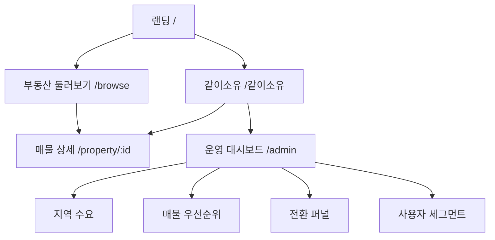

# 같이 소유해요 수요 데이터 플랫폼 기획 문서

## 1. 문서 목적
- 사전예약금 기반 수요 데이터를 체계적으로 수집/해석하여 매입·공모 의사결정에 활용한다.
- 기존 "매입 후 공모" 중심 흐름을 "수요 확인 후 매입·공모" 흐름으로 고도화한다.

## 2. 제품 비전
- 핵심 가치: "우리가 같이 고른 부동산을 같이 소유한다."
- 플랫폼 역할:
  - 사용자: 소액으로 관심 매물에 사전예약금 의향 표시
  - 회사: 수요 데이터 기반으로 매입·공모 우선순위 결정
  - 시장: 지역/유형별 부동산 수요 신호 축적

## 3. 서비스 범위
### 3.1 사용자 영역
- `/같이소유`: 개인 요약 대시보드(한도, 사전예약금, 이행률, 보유)
- `/browse`: 지도 기반 매물 탐색 + 사전예약금 등록
- `/property/[id]`: 매물 상태, 사전예약금 진행, 공모 액션

### 3.2 운영/분석 영역
- `/admin` (신규): 수요 대시보드, 퍼널, 매입 우선순위 보드

## 4. 상태 머신
- `DISCOVERY`: 조건부 계약/검토중
- `VOTING_OPEN`: 사전예약금 모집중
- `VOTING_MET`: 목표 달성(공모 오픈 대기)
- `PUBLIC_OFFER`: 공모 진행중
- `TRADABLE`: 공모/배정 완료, 거래 가능
- `CLOSED`: 종료

### 4.1 전이 규칙
- `DISCOVERY -> VOTING_OPEN`: 매물 검토 완료 후 오픈
- `VOTING_OPEN -> VOTING_MET`: 사전예약금 총액 >= 목표금액
- `VOTING_MET -> PUBLIC_OFFER`: 운영자 공모 오픈 승인
- `PUBLIC_OFFER -> TRADABLE`: 배정/이행 완료
- `* -> CLOSED`: 종료 조건 충족

## 5. 용어 체계
- `사전예약금`: 수요 확인 단계에서 사용자의 의향 금액
- `공모 청약금`: 공모 단계의 실제 청약 금액
- `투자 전환금`: 이행 완료 후 보유로 전환된 금액

## 6. IA (정보구조)


## 7. 화면별 컴포넌트 명세
## 7.1 `/같이소유`
- `UserSummaryCard`
  - 필드: 잔고, 사전예약 가능 한도, 총 사전예약금, 이행률, 신뢰점수
- `StageOverviewCard`
  - 필드: 사전예약 진행 건수, 목표 달성 건수, 공모 진행 건수
- `MyReservationsList`
  - 필드: 매물명, 사전예약금, 상태(ACTIVE/FULFILLED/CANCELLED), 생성일
- `MyHoldingsList`
  - 필드: 매물명, 전환금, 생성일

## 7.2 `/browse`
- `BrowseTopBar`
  - 필드: 검색어, 지역/유형/위험도/최소수익률 필터
- `PropertyListPanel`
  - 필드: 매물명, 단계, 참여자 수, 사전예약금/목표금액, 진행률
- `DemandMap`
  - 기능: 클러스터, 선택 동기화, 지역 수요 시각화
- `ReservationPanel`
  - 필드: 사전예약금 입력, 한도 메시지, 상태 제한 메시지

## 7.3 `/property/[id]`
- `PropertyHeader`
  - 필드: 주소/유형/위험도/예상수익률/참여자 수
- `DemandProgressCard`
  - 필드: 사전예약금 총액, 목표금액, 진행률, 단계 설명
- `ActionCard`
  - 버튼 노출 규칙:
    - `VOTING_OPEN`: 사전예약금 등록
    - `VOTING_MET`: 공모 오픈
    - `PUBLIC_OFFER`: 예약 이행(투자 전환)
- `RecentDemandEvents`
  - 필드: 사용자(익명ID), 상태, 금액, 일시

## 7.4 `/admin` (신규)
- `DemandKpiRow`
  - 지표: 총 사전예약금, 활성 참여자, 목표달성 매물 수, 공모 성사율
- `RegionHeatTable`
  - 필드: 지역, 사전예약금 합계, 참여자수, 성장률
- `PropertyPriorityBoard`
  - 필드: 우선순위 점수, 단계, 달성률, 최근 7일 성장률
- `FunnelChart`
  - 지표: VOTING_OPEN -> VOTING_MET -> PUBLIC_OFFER -> TRADABLE 전환률

## 8. 데이터 모델 확장안
## 8.1 이벤트 모델
```json
{
  "id": "de_20260223_001",
  "userId": "u1",
  "propertyId": "p12",
  "regionCode": "KR-11-SONGPA",
  "eventType": "CREATE",
  "intentAmount": 5000000,
  "statusBefore": "VOTING_OPEN",
  "statusAfter": "VOTING_OPEN",
  "createdAt": "2026-02-23T12:30:00.000Z",
  "sessionId": "s_abc123",
  "channel": "web"
}
```

## 8.2 일별 집계 모델
```json
{
  "date": "2026-02-23",
  "propertyId": "p12",
  "uniqueVoters": 142,
  "intentTotal": 3340000000,
  "intentGrowth1d": 0.087,
  "targetCoverage": 0.56,
  "fulfillmentRate": 0.41
}
```

## 9. KPI 정의
- `지역 수요지수` = (지역 사전예약금 합계 * 0.7 + 참여자수 * 0.3) / 활성매물수
- `목표 달성 속도` = 최근 7일 사전예약금 증가율
- `이행 전환율` = 투자 전환금 합계 / 사전예약금 합계
- `공모 성사율` = TRADABLE 전환 매물 수 / PUBLIC_OFFER 매물 수
- `수요 신뢰도` = 재참여 비율 * (1 - 취소율)

## 10. 운영 의사결정 룰
- 매입 검토 우선순위 조건(예시)
  - `targetCoverage >= 0.6`
  - 최근 7일 `intentGrowth1d > 0`
  - 참여자 집중도(상위 5명 비중) 임계치 이하
- 공모 오픈 게이트
  - 상태 `VOTING_MET`
  - 이상치(비정상 급증) 탐지 미발생

## 11. 정책/카피 가이드
- 고정 문구:
  - "사전예약금은 수요 확인 단계 금액입니다."
  - "공모 단계에서 실제 참여가 확정됩니다."
  - "이행 실적에 따라 사전예약 가능 한도가 조정됩니다."

## 12. MVP 구현 우선순위
1. 상태 머신 + 용어 체계(완료)
2. `/browse` 수요 신호 강화(완료)
3. `/property/[id]` 단계별 액션 제어(완료)
4. `DemandEvent` 로깅 테이블 추가
5. `/admin` 수요 대시보드 신규 구현
6. 이상치 탐지/우선순위 점수 자동화

## 13. 리스크 및 대응
- 규제 해석 리스크: 금액 용어 오인 가능
  - 대응: 단계별 고정 안내문구 + 정책 페이지
- 데이터 품질 리스크: 중복/봇 이벤트
  - 대응: 세션 식별, rate limit, 이상치 규칙
- 해석 리스크: 단기 급증 왜곡
  - 대응: 1일/7일/28일 지표 병행

## 14. 성공 기준
- 월 기준
  - 활성 사전예약 참여자 증가율 > 20%
  - `VOTING_OPEN -> VOTING_MET` 전환율 증가
  - 공모 성사율 개선
  - 지역 수요 리포트 기반 매입 의사결정 적용률 80% 이상
